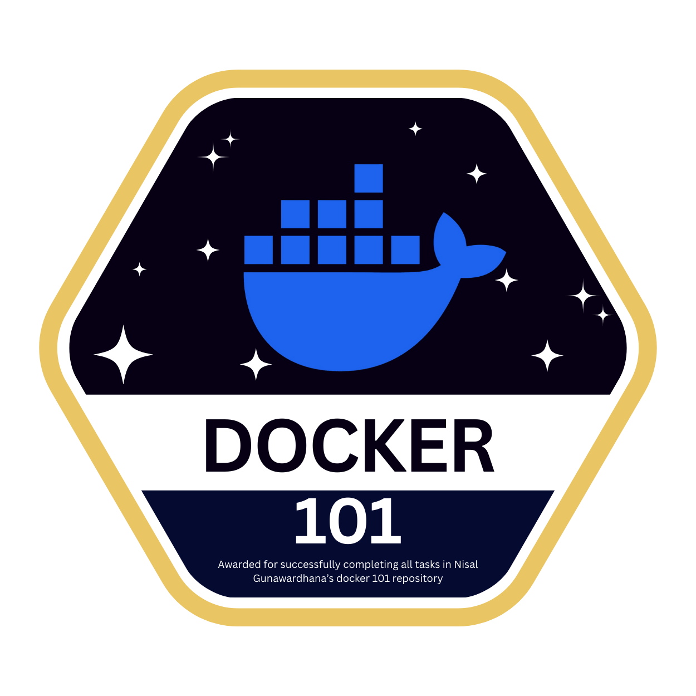

Docker 101 Learning Repository
==============================

Welcome to **Docker 101** — a hands-on learning repository designed to help you master Docker fundamentals through practical labs and real-world exercises.

## About This Course

This repository provides a structured path to learn containerization with Docker. You'll start with basic concepts, work through hands-on labs covering essential Docker workflows, and submit your work for review to earn a completion badge.

**What you'll learn:**
- Understanding containers, images, and Docker architecture
- Running and managing containers
- Building custom Docker images with Dockerfiles
- Orchestrating multi-container applications with Docker Compose
- Pushing images to container registries

**Prerequisites:** Docker Desktop (or Docker Engine), Git, and a terminal.

---

## �️ Learning Paths

Choose your path based on your experience and learning style:

### 🚀 Fast Track (3-4 hours)
1. [Quick Start Guide](docs/quick-start.md) - 30 min
2. Complete Labs 1-4 - 2-3 hours
3. Skim [Theory Guide](docs/theory.md) for gaps

### 📚 Complete Course (8-12 hours)
1. [Learning Path Overview](docs/LEARNING-PATH.md) - Plan your journey
2. [Theory Guide](docs/theory.md) - 2-3 hours
3. [Hands-on Labs](docs/hands-on.md) - 4-6 hours
4. Build your own project - 2+ hours

### 🎯 Just the Essentials (1 hour)
1. [Quick Start Guide](docs/quick-start.md) - Read entirely
2. Try the workflow examples
3. Use [Cheat Sheet](docs/cheat-sheet.md) as reference

---

## 📚 Course Contents

### 🎯 Start Here
- [**docs/LEARNING-PATH.md**](docs/LEARNING-PATH.md) — **Your roadmap** with recommended paths, visual guides, and success criteria
- [**docs/quick-start.md**](docs/quick-start.md) — **⚡ Quick Start** for the three main tasks: Create Image → Run Container → Push

### 📖 Learn
- [**docs/theory.md**](docs/theory.md) — **Complete Docker Theory** (containerization, architecture, all components explained)
- [**docs/visual-reference.md**](docs/visual-reference.md) — **📊 Visual diagrams** for architecture, workflows, and patterns
- [**docs/basics.md**](docs/basics.md) — Quick reference of core concepts

### 🔨 Practice
- [**docs/hands-on.md**](docs/hands-on.md) — **5 Comprehensive Labs** with step-by-step instructions
  - Lab 1: Run your first container
  - Lab 2: Build custom image from Dockerfile
  - Lab 3: Create optimized Node.js app
  - Lab 4: Push image to Docker Hub
  - Lab 5: Multi-container app with Compose

### 🚀 Reference
- [**docs/cheat-sheet.md**](docs/cheat-sheet.md) — Essential command reference
- [**submission/**](submission/) — Submission guide and screenshots folder

---

## 🎯 Lab Tasks Overview

You will complete **5 comprehensive labs**:

| Lab | Task | Key Skills |
|-----|------|------------|
| **Lab 1** | Run your first container | Pull images, understand containers vs images, `docker ps`, `docker images` |
| **Lab 2** | Build and run a custom image | Write Dockerfile, build images, run containers, port mapping, logs |
| **Lab 3** | Create and customize your own image | Advanced Dockerfile, multi-stage builds, optimization, security |
| **Lab 4** | Push image to Docker Hub | Tag images, authenticate, push/pull from registry, share images |
| **Lab 5** | Docker Compose multi-container app | Orchestrate services, networking, volumes, `docker-compose.yml` |

Each lab includes:
- **Theory review** of concepts
- **Detailed step-by-step instructions**
- **Command explanations**
- **Screenshots to capture** as proof
- **Key takeaways** summary

Complete instructions in [docs/hands-on.md](docs/hands-on.md).

---

## 🚀 How to Complete This Course

Follow these steps to complete the Docker 101 course and submit your work:

### Step 1: Fork This Repository
1. Click the **Fork** button at the top-right of this repository
2. This creates your own copy of the repo under your GitHub account

### Step 2: Clone Your Fork
```bash
git clone <your-fork-url>
cd docker-101
```

### Step 3: Create a New Branch
```bash
git checkout -b docker-101
```
*All your work will be done in this branch.*

### Step 4: Complete the Labs
1. Open [docs/hands-on.md](docs/hands-on.md) and work through **Lab 1**, **Lab 2**, **Lab 3**, and optionally **Lab 4**
2. For each lab, capture the requested screenshots:
   - Lab 1: `01-hello-world-output.png`, `02-docker-ps.png`
   - Lab 2: `03-build-output.png`, `04-curl-response.png`
   - Lab 3: `05-compose-ps.png`, `06-nginx-curl.png`
   - Lab 4 *(optional)*: `07-registry-tag.png`
3. Save all screenshots to the `submission/screenshots/` folder

### Step 5: Commit and Push Your Work
```bash
git add submission/screenshots/*
git commit -m "Complete Docker 101 labs with screenshots"
git push origin docker-101
```

### Step 6: Create a Pull Request (PR)
1. Go to **your forked repository** on GitHub
2. Click **"Compare & pull request"** for the `docker-101` branch
3. Set the base repository to **your fork's `main` branch** (not the original repo)
4. Add a description of what you learned and submit the PR
5. **Copy the PR link** (e.g., `https://github.com/your-username/docker-101/pull/1`)

### Step 7: Submit for Review
1. Go to the **[Issues page of the ORIGINAL repository](../../issues)** (nisalgunawardhana's repo)
2. Click **"New Issue"** → Select the **"Submission"** template
3. Fill in the form:
   - Paste your **PR link** from Step 6
   - Add your name and any notes
   - Submit the issue
4. Automation will label your submission as `pending review`
5. Wait for `nisalgunawardhana` to review and close your submission issue
6. Upon approval, you'll receive the **Docker 101 completion badge**! 🎉

---

## 🏆 Completion Badge

When your submission is approved, the automation will post a completion comment with the Docker 101 badge on your issue:



---

## ❓ Need Help?

- Check the **Troubleshooting** section in [docs/hands-on.md](docs/hands-on.md)
- Review the [docs/cheat-sheet.md](docs/cheat-sheet.md) for command syntax
- Open a draft PR or issue with questions (keep labels intact for automation tracking)

---

**Ready to get started?** Begin with [docs/basics.md](docs/basics.md) to understand the fundamentals, then dive into the labs! 🐳
